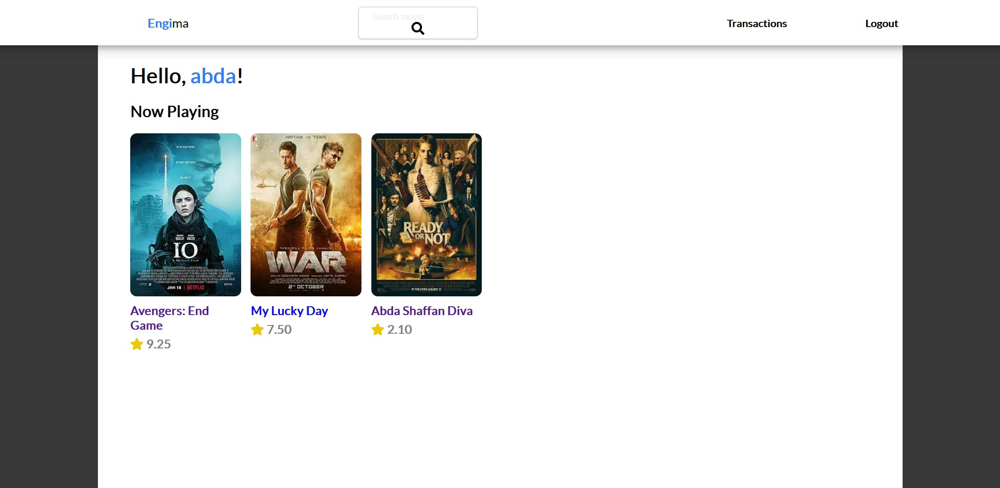
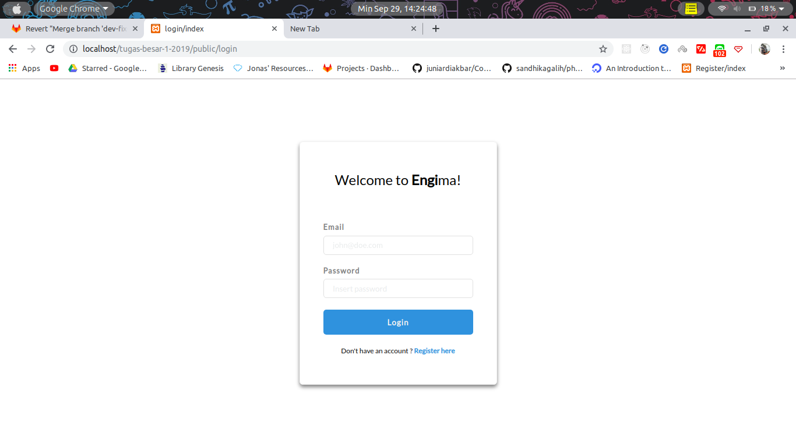
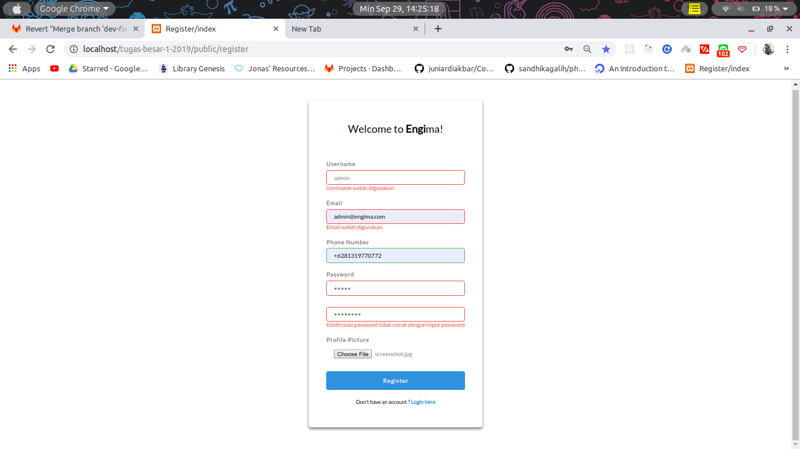
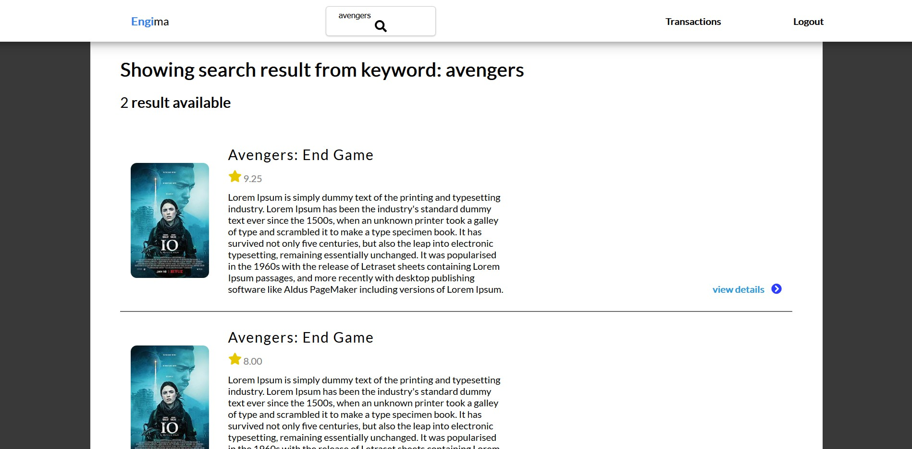
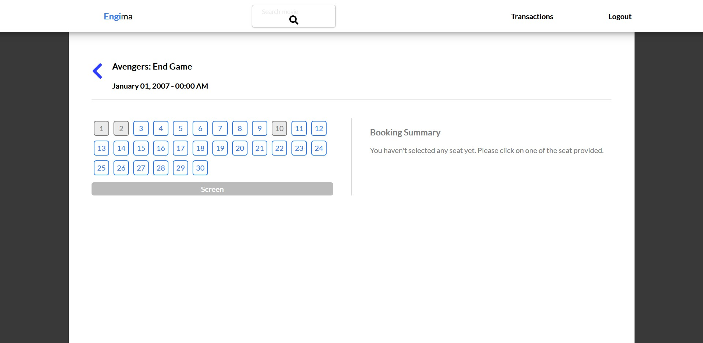
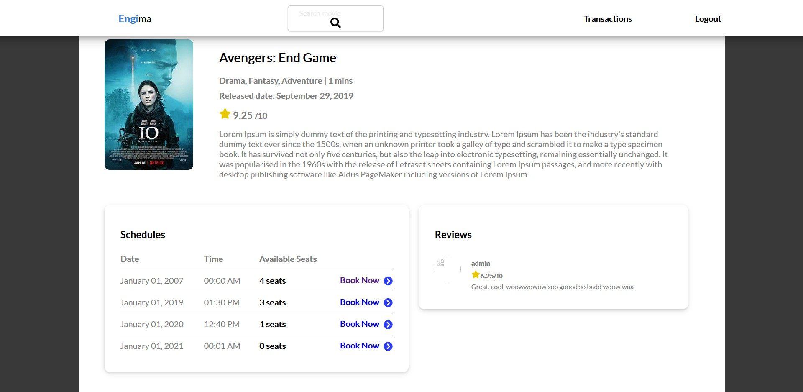

# Engima
Engima dibuat untuk memenuhi Tugas 1 IF3110 Pengembangan Aplikasi Berbasis Web.

Kontributor:
* Seldi Kurnia Trihardja/13516042
* Abda Shaffan Diva/13517021
* Rika Dewi/13517147
## Deskripsi 
Engima adalah aplikasi web pemesanan tiket bioskop daring untuk membantu saudara Engi dalam usahanya menjalankan sinema.
Fitur-fitur yang dimiliki Engima berguna bagi para pelanggan dengan memberikan kemudahan dalam memesan tiket sehingga pelanggan lebih mungkin untuk kembali membeli.
Berikut adalah fitur yang dimiliki oleh Engima:
* Pencarian film
* Pembelian tiket
* Pemberian ulasan
* Riwayat pembelian tiket
 
## Requirement
Pastikan sistem Anda memiliki hal-hal berikut sebelum menjalankan sistem:
* PHP 
* MySQL
* Server
* Javascript
* Browser dan Database

## Instalation
* Siapkan Server atau aplikasi server anda
* Taruh Folder proyek ini kedalam Server anda
* Import Database dari file sql yang ada pada folder Database
* Atur config dari Server anda untuk menghubungkan server dengan database
* Atur config dari file (config.php) supaya memiliki isi yang benar
* Laman anda siap dijalankan!

## Running Server
* Nyalakan Server dan Database anda (Apache dan MySql pada XAMPP)
* Buka Laman anda sesuai dengan path yang anda tentukan (default: http://localhost/-nama_folder- jika menggunakan XAMPP)

## Screenshot
### Home

### Login

### Register

### Search

### Seats

### Film

### Transaction History

### Review Page

## Pembagian Tugas
Berikut adalah pembagian tugas kelompok kami.
### Frontend
1. Login: 13517021
2. Register: 13517021
3. Home: 13517147
4. Search: 13517021
5. Film Detail: 13517147
6. Buy Ticket: 13517147
7. Transaction History: 13516042
8. User Review: 13516042

### Backend
1. Login: 13517021
2. Register: 13517021
3. Home: 13517147
4. Search: 13517021
5. Film Detail: 13517147
6. Buy Ticket: 13517147
7. Transaction History: 13516042
8. User Review: 13516042
