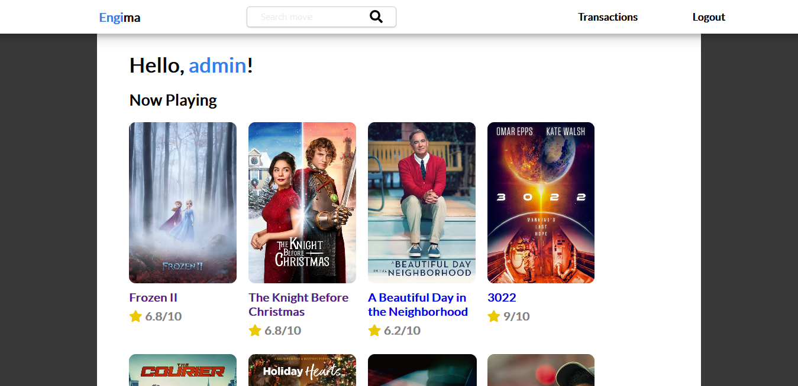
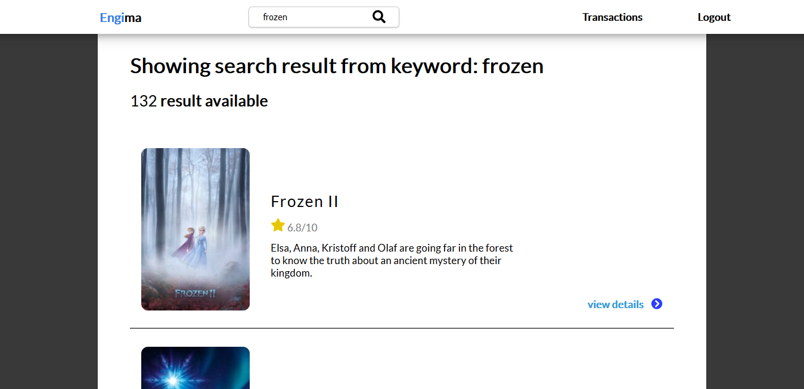
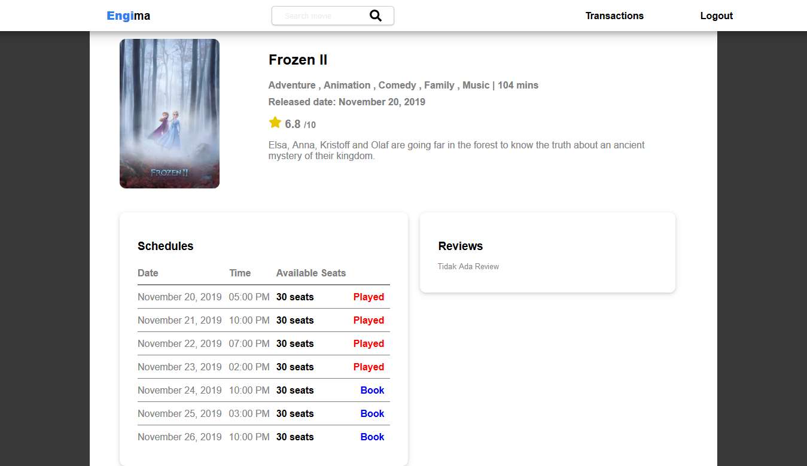
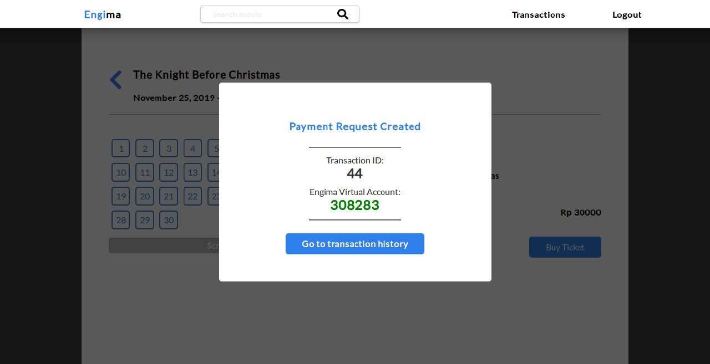

# Engima

## Deskripsi Aplikasi Engima

## Basis data Engima yang telah diubah
Aplikasi Engima tidak lagi menggunakan tabel movie yang berisi data mengenai movie, karena movie dan data movie diambil langsung dari TheMovieDB. 

## Screenshot perubahan tampilan pada engima
1. Home denagn data dari TheMovieDB

2. Search dengan data dari TheMovieDB

3. Movie detail dengan data dari TheMovieDB

3. Pemesanan Tiket

## Pembagian tugas WBD IF3110
### REST
1. Menambah transaksi baru : 13517096
2. Mengubah status transaksi : 13517108
3. Mengembalikan seluruh data transaksi : 13517021
4. Skema database : 13517108

### SOAP
1. Validasi no rekening : 13517021
2. Memberi data rekening nasabah : 13517096
3. Transaksi transfer : 13517108
4. Membuat virtual account : 13517021
5. Mengecek data transaksi : 13517096

### ReactJS
1. Template bank-pro : 13517021
2. Login : 13517021
3. Transfer : 13517096
4. Riwayat : 13517108

### Perubahan Engima
1. Pemgambilan data film ke home : 13517108
2. Detail film dan search : 13517108
3. Buy ticket : 13517021
4. Transaction history : 13517096
5. Transaksi tiket film : 13517021

### Untuk tugas DPPL IF3159
1. Continous Integration :
    a. Linting : 13517096
2. Eksplorasi EC2 : 13517096
3. Deployment Engima ke EC2: 13517096
4. Deployment basis data Engima ke Amazon RDS : 13517096
5. Continuous Deployment :
    b. Deploy ke httpd : 13517096
6. URL deployment : http://ec2-107-21-68-151.compute-1.amazonaws.com